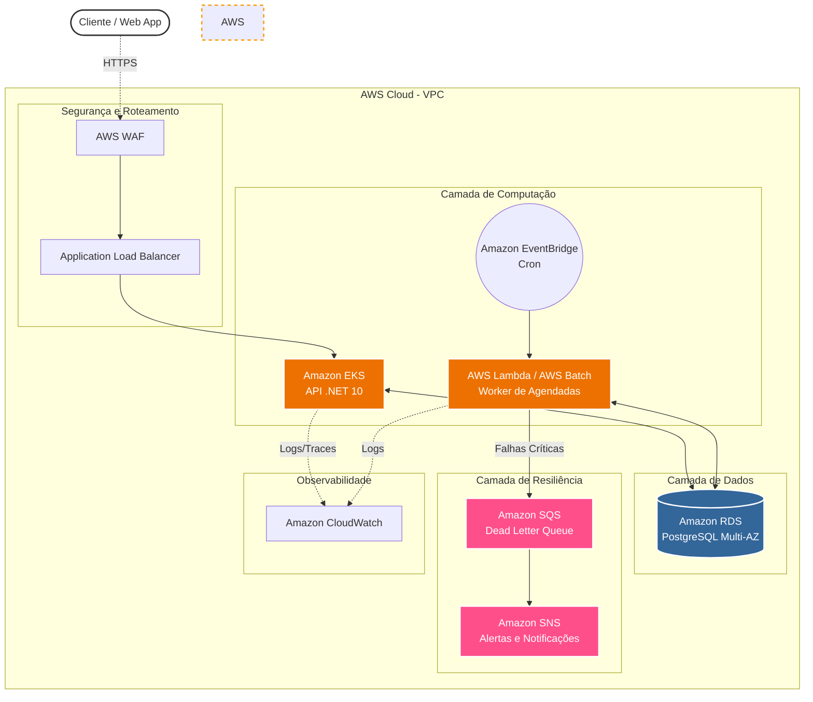

# API Fundo de Investimento

Uma API para gestão de aportes e resgates de um fundo de investimentos fictício, focada em alta performance e consistência transacional.

## Tecnologias Utilizadas

* **.NET 10 (C#):** Framework principal utilizando as últimas funcionalidades da linguagem.
* **PostgreSQL:** Banco de dados relacional para garantia de transações ACID.
* **Dapper:** Micro-ORM para acesso a dados de alta performance e controle total sobre as queries.
* **Serilog & Seq:** Log estruturado (JSON) e painel de observabilidade em tempo real.
* **Polly:** Tratamento de resiliência e políticas de Retry para o banco de dados.
* **OpenAPI / Scalar:** Para documentação interativa da API.
* **xUnit, Moq & AutoFixture:** Suíte completa de testes unitários isolados.

## Estrutura do Projeto

O projeto foi desenhado seguindo os princípios de **Clean Architecture** e **Domain-Driven Design (DDD)**:

* **FundoInvestimento.Api:** Camada de apresentação. Contém os endpoints REST, configurações de injeção de dependência e middlewares.
* **FundoInvestimento.Application:** Orquestração dos casos de uso. Contém os serviços de aplicação, DTOs e interfaces de abstração (ex: repositórios e Unit of Work).
* **FundoInvestimento.Domain:** O coração do sistema. Contém as Entidades ricas, Enums e as regras de negócio fundamentais sem dependências externas.
* **FundoInvestimento.Infrastructure:** Implementação técnica. Contém os repositórios (Dapper), conexão com o banco e lógica de inicialização de dados.
* **FundoInvestimento.Libs:** Biblioteca de utilitários e pacotes compartilhados entre as camadas.
* **FundoInvestimento.Tests:** Garantia de qualidade com testes unitários focados nas regras de negócio e validação de cenários.

---

## Padrões e Decisões Arquiteturais

### 1. Unit of Work (Transações ACID)
Como operações financeiras (Aporte/Resgate) afetam múltiplas tabelas simultaneamente (atualizam saldo do cliente, posição de cotas e inserem histórico de ordens), o sistema implementa o padrão **Unit of Work**. Ele compartilha a mesma `DbSession` e transação do banco de dados entre os Repositórios do Dapper. Isso garante que a operação seja atômica: se qualquer validação ou persistência falhar no meio do processo, ocorre um `Rollback` completo, blindando o sistema contra dados corrompidos.

### 2. Controle de Concorrência (Pessimistic Locking)
Para lidar com requisições simultâneas e prevenir a **Condição de Corrida (Race Condition)**, a aplicação utiliza **Locks Pessimistas** diretamente no nível do banco de dados através da cláusula `FOR UPDATE` no PostgreSQL.

### 3. Result Pattern
O sistema evita o uso de *Exceptions* para controle de fluxo ou quebra de regras de negócio conhecidas (ex: saldo insuficiente, fundo fechado). Em vez disso, a camada de domínio utiliza o padrão **Result Pattern** (`Result` / `Result<T>`) presente no módulo `FundoInvestimento.Libs`. Isso torna o tratamento de erros explícito, padroniza as respostas de erro HTTP e aumenta a performance da aplicação.

### 4. Strategy Pattern
As regras de negócio específicas para `APORTE` e `RESGATE` foram isoladas em estratégias distintas (`ProcessadorAporteStrategy` e `ProcessadorResgateStrategy`), garantindo os princípios SRP (Responsabilidade Única) e OCP (Aberto/Fechado) do SOLID.

---

## Configuração e Segurança

### 1. Gestão de Secrets
Para garantir a segurança, a connection string do banco de dados não é armazenada no `appsettings.json`.

* **Desenvolvimento (Local):** Utilize o **.NET User Secrets**.
    ```bash
    dotnet user-secrets init
    dotnet user-secrets set "ConnectionStrings:Database" "Sua_Connection_String_Aqui"
    ```
* **Produção:** A aplicação lê a variável de ambiente `ConnectionStrings__Database`.

### 2. Inicialização do Banco de Dados
A aplicação possui um serviço de `DatabaseInitializer` que executa os scripts DDL automaticamente ao iniciar, porém, por segurança, esta funcionalidade está restrita ao ambiente de **Desenvolvimento (`Development`)**.

---

## Como Executar o Projeto

### Pré-requisitos
* [.NET 10 SDK](https://dotnet.microsoft.com/download)
* [Docker Desktop](https://www.docker.com/products/docker-desktop)

### Passo a Passo (Ambiente Local)

1. **Suba a infraestrutura completa:**
   Na raiz do projeto, onde está o arquivo `docker-compose.yml`, execute o comando abaixo para compilar a imagem da API e subir todos os serviços em background:
   ```bash
   docker-compose up --build -d
   ```
3. Acesse as Ferramentas:
   API / Scalar: http://localhost:5000/scalar
   Painel de Logs (Seq): http://localhost:5341 (usuário: admin | senha: admin123)

# Desenho de Solução na Nuvem (AWS)



## Componentes da Arquitetura

### APIs (Amazon EKS)

A API REST pode utilizar Docker para rodar em clusters Kubernetes gerenciados pelo Amazon EKS. Isso permite um ecossistema robusto para orquestração, Horizontal Pod Autoscaling (HPA) para absorver picos agressivos de acesso (como na abertura do mercado) e rolling updates sem downtime.

### Processamento Assíncrono (Lambda / AWS Batch)

Na evolução da arquitetura para a nuvem, o Quartz.NET (que roda em memória) pode ser facilmente substituído pelo AWS EventBridge atuando como scheduler (Cron). Ele acionaria funções AWS Lambda (para processamentos rápidos) ou o AWS Batch.

### Mensageria e DLQ (SQS/SNS)

Para elevar a consistência do fluxo financeiro, ordens que falhem sucessivamente por problemas de infraestrutura ou erros não previstos (após passarem pelas retentativas do Polly) são enviadas para uma Dead Letter Queue (DLQ) usando Amazon SQS.

Um tópico do Amazon SNS monitora essa DLQ para disparar alertas imediatos para a equipe responsável, evitando que a falha passe despercebida.

### Banco de Dados (Amazon RDS)

O PostgreSQL roda no RDS com configuração Multi-AZ, garantindo failover automático em caso de queda do data center primário, mantendo o controle de concorrência blindado.

### Segurança e Observabilidade

O tráfego passa por um AWS WAF mitigando ataques. Toda a emissão de logs estruturados e métricas da aplicação são ingeridas centralmente no Amazon CloudWatch.

# Uso de IA

Neste projeto, a Inteligência Artificial foi utilizada como uma ferramenta de Pair Programming, acelerando o ciclo de desenvolvimento.

As principais frentes de atuação foram:

- **Documentação** Auxílio no README, além de documentação no código e OpenAPI.

- **Testes Unitários:** Geração do boilerplate das suítes de testes (xUnit + Moq), permitindo direcionar o foco humano exclusivamente à validação das asserções financeiras e lógicas de negócios.

- **Discussões Técnicas:**: Discussões de patterns, melhores práticas, formas de implementar features e bugfixes.

- **Códigos Boilerplate:**: Configurações iniciais, como OpenAPI, Observability, configurações de JSON, etc.

## Modelagem do Banco de Dados
		
### 1. Clientes (`cliente`)
| Campo | Descrição |
|---|---|
| `id` | Identificador único (UUIDv7) |
| `nome` | Nome completo do cliente |
| `cpf` | CPF único (sem formatação) |
| `saldo_disponivel` | Saldo líquido para novos investimentos |

### 2. Catálogo de Fundos (`fundo`)
| Campo | Descrição |
|---|---|
| `id` | Identificador único (UUIDv7) |
| `nome` | Nome do fundo de investimento |
| `horario_corte` | Horário limite (cut-off) para ordens no mesmo dia (D+0) |
| `valor_cota` | Valor unitário atual da cota (alta precisão) |
| `valor_minimo_aporte` | Valor mínimo para entrada no fundo |
| `valor_minimo_permanencia` | Valor residual mínimo exigido após resgates |
| `status_captacao` | Indica se o fundo está `ABERTO` ou `FECHADO` |

### 3. Posição do Cliente (`posicao_cliente`)
| Campo | Descrição |
|---|---|
| `id_cliente` | FK para tabela de clientes |
| `id_fundo` | FK para tabela de fundos |
| `quantidade_cotas` | Saldo atual de cotas do cliente no fundo específico |

### 4. Ordens e Agendamentos (`ordem`)
| Campo | Descrição |
|---|---|
| `id` | Identificador único (UUIDv7) |
| `id_cliente` | FK do solicitante |
| `id_fundo` | FK do fundo de destino |
| `tipo_operacao` | Tipo: `APORTE` ou `RESGATE` |
| `quantidade_cotas` | Volume da transação em cotas |
| `data_agendamento` | Data programada (NULL para ordens imediatas) |
| `status` | `PENDENTE`, `CONCLUIDO` ou `REJEITADO` |
| `criado_em` | Timestamp da criação da solicitação |

### Diagrama Entidade-Relacionamento (MER/DER)

```mermaid
erDiagram
    CLIENTE ||--o{ POSICAO_CLIENTE : "possui"
    CLIENTE ||--o{ ORDEM : "solicita"
    FUNDO ||--o{ POSICAO_CLIENTE : "compoe"
    FUNDO ||--o{ ORDEM : "recebe"

    CLIENTE {
        uuid id PK
        varchar nome
        varchar cpf UK
        numeric saldo_disponivel
    }
    
    FUNDO {
        uuid id PK
        varchar nome
        time horario_corte
        numeric valor_cota
        numeric valor_minimo_aporte
        numeric valor_minimo_permanencia
        varchar status_captacao
    }
    
    POSICAO_CLIENTE {
        uuid id_cliente PK, FK
        uuid id_fundo PK, FK
        integer quantidade_cotas
    }
    
    ORDEM {
        uuid id PK
        uuid id_cliente FK
        uuid id_fundo FK
        varchar tipo_operacao
        integer quantidade_cotas
        date data_agendamento
        varchar status
        timestamptz criado_em
    }